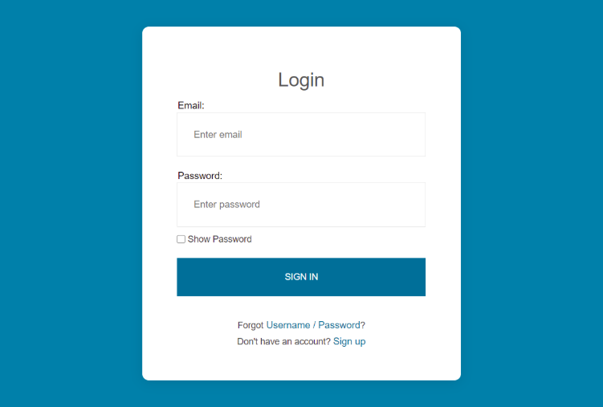

# week-three Assignment: Login Form Design

## Assignment Overview
Your task is to recreate the login form design shown in the provided image using **HTML and CSS**. Pay close attention to the structure, layout, colors, and typography to ensure accuracy.



### **Requirements**
- Use **HTML** to structure the page elements.
- Use **CSS** to style the page and match the given design.
- Ensure the login form includes:
  - An email input field.
  - A password input field.
  - A "Show Password" checkbox.
  - A "Sign In" button.
  - A "Forgot Username/Password?" link.
  - A "Sign Up" link for new users.
- Use a visually appealing background color similar to the one in the image.

## **Submission Instructions**
Follow the contribution guide below to submit your assignment properly.

---

# GitHub Contribution Guide For WDD January - June 2025

Here you'll find the GitHub and Web Development activities of the WDD Jan-June 2025 students.

## **Step-by-Step Contribution Guide**

### **1. Fork the Repository**
Start by forking the **WDD-Jan2025** repository to your GitHub account. This creates a personal copy of the repository where you can make changes without affecting the original.

- Go to the repository page: **WDD-Jan2025**.
- Click the **Fork** button at the top-right corner of the page.

### **2. Clone the Forked Repository**
Clone the repository you just forked to your local machine:

```bash
git clone https://github.com/<your_username>/WDD-Jan2025.git
cd WDD-Jan2025
```

### **3. Navigate to the Weekly Project Folder**
Each week has a designated project folder inside the repository. Navigate to the folder for the current week (e.g., week-three):

```bash
cd week-<week_number>
```
**Example:**
```bash
cd week-three
```

### **4. Create Your Folder**
Inside the weekly folder, create a new folder named after your first name or a unique identifier (e.g., john, jane-doe):

```bash
mkdir <your_name>
```
**Example:**
```bash
mkdir john
```

### **5. Add Your Project Files**
Place all the files related to your project (**HTML, CSS, assets, documentation**) into your folder. Ensure your files are organized and well-documented.

### **6. Commit Your Changes**
Stage and commit your changes with a clear and descriptive commit message:

```bash
git add .
git commit -m "Add Week <week_number> project for <your_name>"
```
**Example:**
```bash
git commit -m "Add Week three project for John Doe"
```

### **7. Push Your Changes**
Push your changes to the remote repository.

```bash
git push origin main
```
If you're on a new branch, use the branch name matching your changes (e.g., week-three-john-project):

```bash
git push origin <your_branch_name>
```
**Example:**
```bash
git push origin week-1-john-project
```

### **8. Create a Pull Request**
- Go to the original GitHub repository in your browser: **WDD-Jan2025**.
- Click on the **Pull Requests** tab.
- Click **New Pull Request** and select **Compare across forks** if needed.
- Select your forked repository and branch as the source, and the main branch of the original repository as the destination.
- Provide a descriptive title and include details about your project in the description.

**Example PR Title:**
```
Add Week three Project for John Doe
```

### **9. Wait for Review**
The repository maintainers will review your pull request. Address any feedback promptly and resubmit if needed.

## **Additional Notes**
- Ensure your project is **complete, well-documented, and functional** before submitting.
- Follow the repository's **coding and folder structure** guidelines.
- **Create a new folder each week** and place all files and assets related to that week's project in the folder.
- If you encounter any issues, contact your tutor for help.

Thank you for contributing to our learning repository! **Happy coding!**
